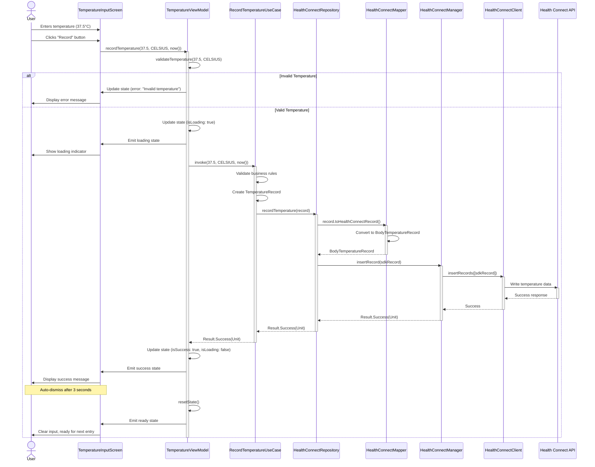
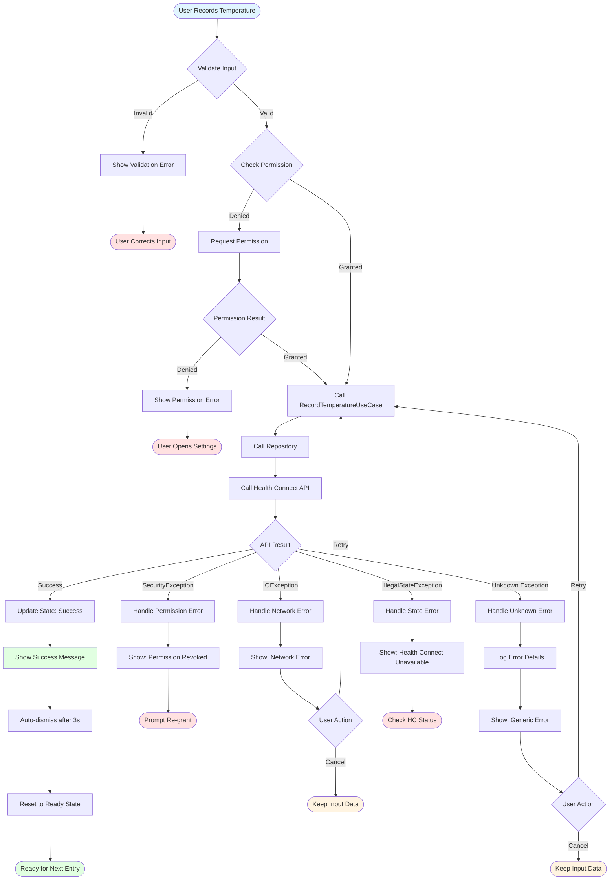
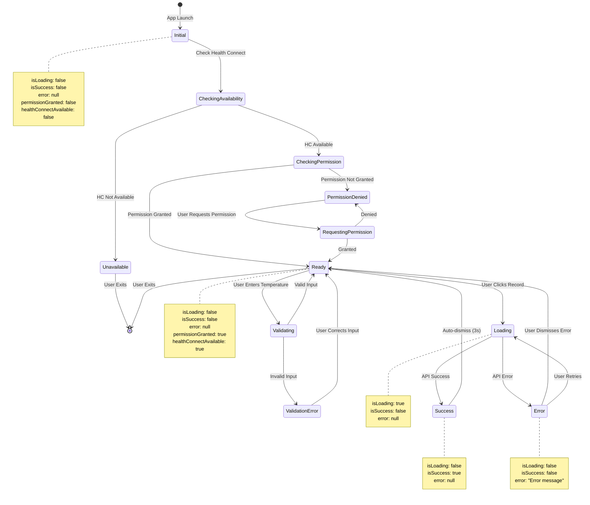
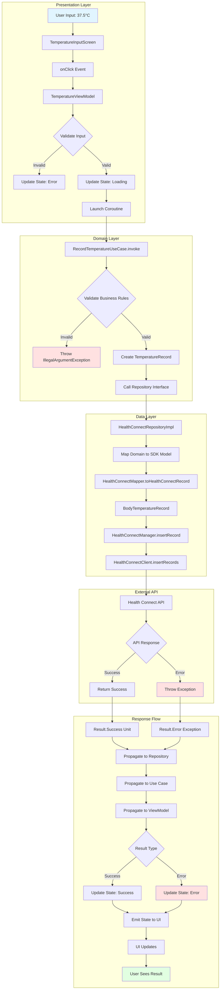
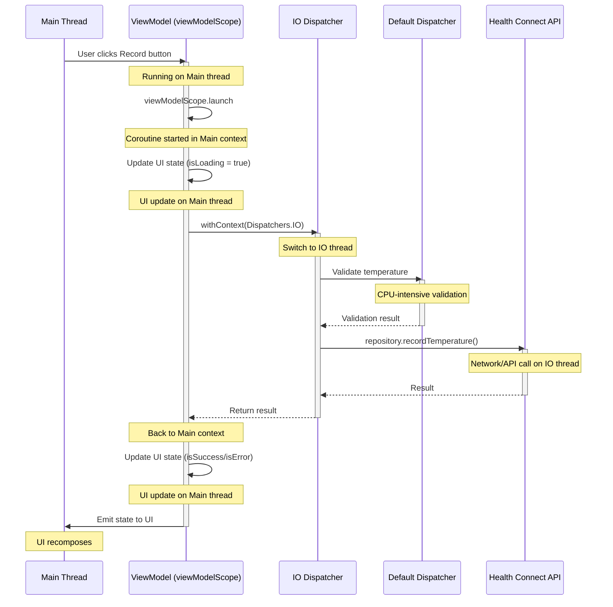
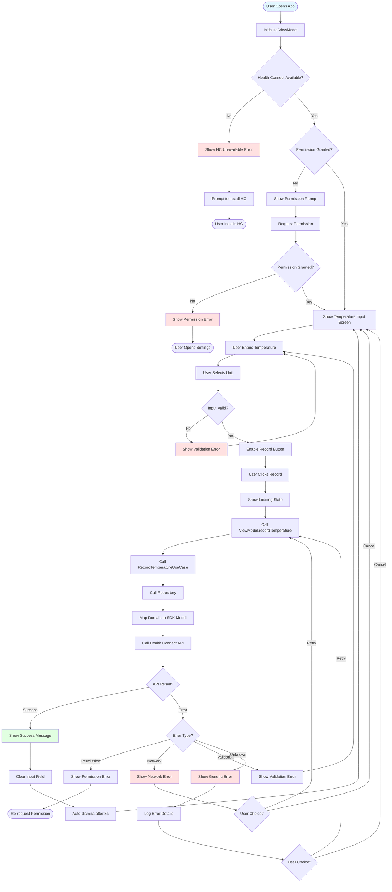

# Health Connect Body Temperature Tracker - Flow Diagrams

## Document Information
- **Project**: Health Connect Body Temperature Tracker
- **Base Package**: `com.eic.healthconnectdemo`
- **Version**: 1.0
- **Last Updated**: October 2025

---

## Table of Contents
1. [End-to-End Temperature Recording Flow](#1-end-to-end-temperature-recording-flow)
2. [Permission Request Flow](#2-permission-request-flow)
3. [Health Connect Availability Check Flow](#3-health-connect-availability-check-flow)
4. [Error Handling Flow](#4-error-handling-flow)
5. [State Management Flow](#5-state-management-flow)

---

## 1. End-to-End Temperature Recording Flow

### 1.1 Complete Flow Diagram (ViewModel → Repository → Health Connect API)



---

## 2. Permission Request Flow

### 2.1 Permission Check and Request Flow

```mermaid
sequenceDiagram
    actor User
    participant UI as TemperatureInputScreen
    participant VM as TemperatureViewModel
    participant UC as RequestPermissionsUseCase
    participant Repo as HealthConnectRepository
    participant HC as HealthConnectClient
    participant System as Android System

    User->>UI: Opens app
    UI->>VM: checkPermissions()
    
    activate VM
    VM->>UC: invoke(WRITE_BODY_TEMPERATURE)
    activate UC
    
    UC->>Repo: checkPermissions({WRITE_BODY_TEMPERATURE})
    activate Repo
    
    Repo->>HC: permissionController.getGrantedPermissions()
    activate HC
    HC-->>Repo: Set<Permission>
    deactivate HC
    
    Repo->>Repo: Compare requested vs granted
    
    alt Permission Already Granted
        Repo-->>UC: Result.Success(true)
        deactivate Repo
        UC-->>VM: Result.Success(true)
        deactivate UC
        VM->>VM: Update state (permissionGranted: true)
        VM->>UI: Emit permission granted state
        UI->>User: Enable temperature recording
    else Permission Not Granted
        Repo-->>UC: Result.Success(false)
        deactivate Repo
        UC-->>VM: Result.Success(false)
        deactivate UC
        VM->>VM: Update state (permissionGranted: false)
        VM->>UI: Emit permission denied state
        UI->>User: Show "Grant Permission" button
        
        User->>UI: Clicks "Grant Permission"
        UI->>VM: requestPermissions()
        
        activate VM
        VM->>UC: invoke(WRITE_BODY_TEMPERATURE)
        activate UC
        
        UC->>Repo: requestPermissions({WRITE_BODY_TEMPERATURE})
        activate Repo
        
        Repo->>HC: permissionController.createRequestPermissionResultContract()
        activate HC
        HC->>System: Launch permission screen
        deactivate HC
        
        System->>User: Display Health Connect permission dialog
        
        alt User Grants Permission
            User->>System: Grants permission
            System->>HC: Permission granted callback
            activate HC
            HC-->>Repo: Granted
            deactivate HC
            Repo-->>UC: Result.Success(true)
            deactivate Repo
            UC-->>VM: Result.Success(true)
            deactivate UC
            VM->>VM: Update state (permissionGranted: true)
            VM->>UI: Emit permission granted state
            UI->>User: Enable temperature recording
        else User Denies Permission
            User->>System: Denies permission
            System->>HC: Permission denied callback
            activate HC
            HC-->>Repo: Denied
            deactivate HC
            Repo-->>UC: Result.Success(false)
            deactivate Repo
            UC-->>VM: Result.Success(false)
            deactivate UC
            VM->>VM: Update state (permissionGranted: false, error: "Permission required")
            VM->>UI: Emit error state
            UI->>User: Show rationale and "Open Settings" button
        end
        deactivate VM
    end
    deactivate VM
```

---

## 3. Health Connect Availability Check Flow

### 3.1 Availability Verification Flow

```mermaid
sequenceDiagram
    actor User
    participant UI as TemperatureInputScreen
    participant VM as TemperatureViewModel
    participant UC as CheckHealthConnectAvailabilityUseCase
    participant Repo as HealthConnectRepository
    participant HC as HealthConnectClient
    participant System as Android System

    User->>UI: Opens app
    UI->>VM: onCreate() / LaunchedEffect
    
    activate VM
    VM->>UC: invoke()
    activate UC
    
    UC->>Repo: checkAvailability()
    activate Repo
    
    Repo->>HC: getSdkStatus(context)
    activate HC
    HC->>System: Query Health Connect status
    System-->>HC: SDK Status
    
    alt SDK_AVAILABLE
        HC-->>Repo: SDK_AVAILABLE
        deactivate HC
        Repo-->>UC: Result.Success(true)
        deactivate Repo
        UC-->>VM: Result.Success(true)
        deactivate UC
        VM->>VM: Update state (healthConnectAvailable: true)
        VM->>UI: Emit available state
        UI->>User: Show temperature input screen
        
    else SDK_UNAVAILABLE
        HC-->>Repo: SDK_UNAVAILABLE
        deactivate HC
        Repo-->>UC: Result.Success(false)
        deactivate Repo
        UC-->>VM: Result.Success(false)
        deactivate UC
        VM->>VM: Update state (healthConnectAvailable: false, error: "Health Connect not installed")
        VM->>UI: Emit unavailable state
        UI->>User: Show error with "Install Health Connect" button
        
        User->>UI: Clicks "Install Health Connect"
        UI->>System: Open Play Store (Health Connect)
        System->>User: Display Health Connect in Play Store
        
    else SDK_UNAVAILABLE_PROVIDER_UPDATE_REQUIRED
        HC-->>Repo: SDK_UNAVAILABLE_PROVIDER_UPDATE_REQUIRED
        deactivate HC
        Repo-->>UC: Result.Success(false)
        deactivate Repo
        UC-->>VM: Result.Success(false)
        deactivate UC
        VM->>VM: Update state (healthConnectAvailable: false, error: "Health Connect update required")
        VM->>UI: Emit update required state
        UI->>User: Show error with "Update Health Connect" button
    end
    deactivate VM
```

---

## 4. Error Handling Flow

### 4.1 Comprehensive Error Handling



---

## 5. State Management Flow

### 5.1 UI State Transitions



---

## 6. Detailed Layer Interaction Flow

### 6.1 Layer-by-Layer Data Flow



---

## 7. Coroutine Flow

### 7.1 Coroutine Context and Threading



---

## 8. Complete Use Case Flow Chart

### 8.1 End-to-End User Journey



---

## 9. Data Transformation Flow

### 9.1 Model Mapping Through Layers

```mermaid
graph LR
    subgraph "UI Layer"
        A[User Input<br/>temperature: String = '37.5'<br/>unit: String = 'Celsius']
    end
    
    subgraph "ViewModel"
        B[Parse Input<br/>temperature: Double = 37.5<br/>unit: TemperatureUnit.CELSIUS]
    end
    
    subgraph "Domain Model"
        C[TemperatureRecord<br/>temperature: Double = 37.5<br/>unit: TemperatureUnit.CELSIUS<br/>timestamp: Instant]
    end
    
    subgraph "Data Layer Mapper"
        D[Map to SDK Model<br/>Convert to Celsius if needed<br/>Create metadata]
    end
    
    subgraph "Health Connect SDK"
        E[BodyTemperatureRecord<br/>temperature: Temperature.celsius 37.5<br/>time: ZonedDateTime<br/>metadata: Metadata]
    end
    
    subgraph "Health Connect API"
        F[Persisted Record<br/>Stored in Health Connect database]
    end
    
    A -->|User submits| B
    B -->|Create domain model| C
    C -->|Map to SDK| D
    D -->|Create SDK record| E
    E -->|Insert| F
    
    style A fill:#e1f5ff
    style C fill:#fff4e1
    style E fill:#e1ffe1
    style F fill:#d4edda
```



---

## 10. How to Use These Diagrams

### 10.1 For Developers
- **Implementation Reference**: Use sequence diagrams to understand method call order
- **Debugging**: Follow flow diagrams to trace issues
- **Testing**: Use flows to create test scenarios

### 10.2 For Architects
- **Design Review**: Validate architectural decisions
- **Documentation**: Share with team for alignment
- **Onboarding**: Help new team members understand the system

### 10.3 For QA
- **Test Case Creation**: Use flows to create comprehensive test cases
- **Edge Case Identification**: Identify all possible paths
- **Acceptance Testing**: Verify all flows work as documented

---

## 11. Diagram Legend

### 11.1 Mermaid Diagram Conventions

**Sequence Diagrams:**
- `actor`: User/external entity
- `participant`: System component
- `activate/deactivate`: Component lifecycle
- `alt/else`: Conditional flows
- `Note`: Additional context

**Flowcharts:**
- `Rectangle`: Process/action
- `Diamond`: Decision point
- `Rounded Rectangle`: Start/end point
- `Parallelogram`: Input/output

**State Diagrams:**
- `State`: System state
- `Transition`: State change
- `Note`: State properties

---

## 12. Rendering Instructions

These diagrams use Mermaid syntax and can be rendered in:
- GitHub Markdown
- GitLab Markdown
- VS Code with Mermaid extension
- Mermaid Live Editor (https://mermaid.live)
- Confluence with Mermaid plugin
- Documentation sites (MkDocs, Docusaurus, etc.)

---

## Document Revision History

| Version | Date | Author | Changes |
|---------|------|--------|---------|
| 1.0 | Oct 2025 | Architecture Team | Initial flow diagrams |
